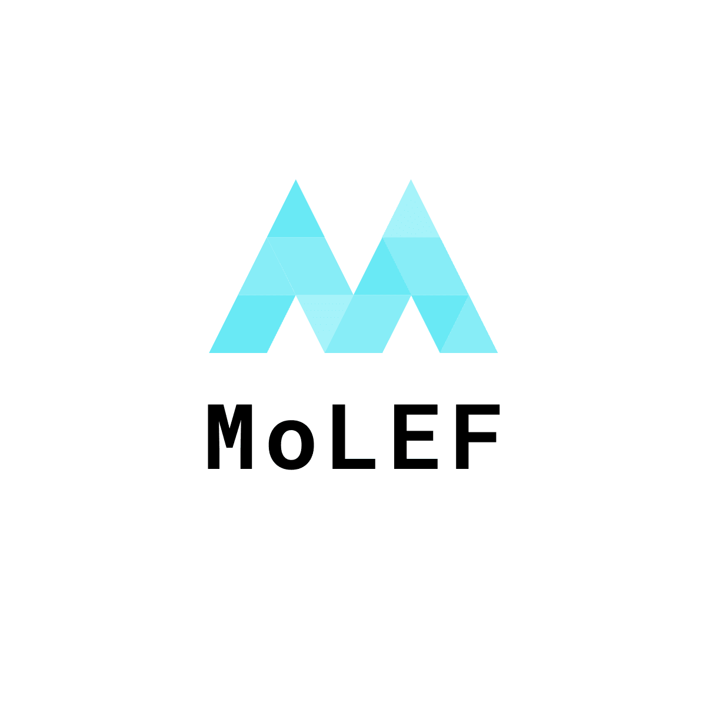
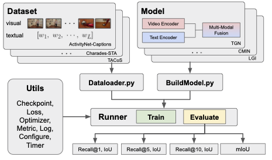

<!--
*** Thanks for checking out the Best-README-Template. If you have a suggestion
*** that would make this better, please fork the repo and create a pull request
*** or simply open an issue with the tag "enhancement".
*** Don't forget to give the project a star!
*** Thanks again! Now go create something AMAZING! :D
-->


<!-- PROJECT SHIELDS -->
<!--
*** I'm using markdown "reference style" links for readability.
*** Reference links are enclosed in brackets [ ] instead of parentheses ( ).
*** See the bottom of this document for the declaration of the reference variables
*** for contributors-url, forks-url, etc. This is an optional, concise syntax you may use.
*** https://www.markdownguide.org/basic-syntax/#reference-style-links
-->
[![Contributors][contributors-shield]][contributors-url]
[![Forks][forks-shield]][forks-url]
[![Stargazers][stars-shield]][stars-url]
[![Issues][issues-shield]][issues-url]
[![MIT License][license-shield]][license-url]

<!-- PROJECT LOGO -->
<br />
<div align="center">
  <a href="https://github.com/jiny419/MoLEF">
    
  </a>

  <h2 align="center">MoLEF</h2>

  <p align="center">
    Moment Localization Evaluation Framework
    <br />
    <a href="https://github.com/jiny419/MoLEF"><strong>Explore the docs »</strong></a>
    <br />
    <br />
    <a href="https://github.com/jiny419/MoLEF">View Demo</a>
    ·
    <a href="https://github.com/jiny419/MoLEF/issues">Report Bug</a>
    ·
    <a href="https://github.com/jiny419/MoLEF/issues">Request Feature</a>
  </p>
</div>


<!-- TABLE OF CONTENTS -->
<details>
  <summary>Table of Contents</summary>
  <ol>
    <li>
      <a href="#about-the-project">About The Project</a>
      <ul>
        <li><a href="#built-with">Built With</a></li>
      </ul>
    </li>
    <li>
      <a href="#getting-started">Getting Started</a>
      <ul>
        <li><a href="#prerequisites">Prerequisites</a></li>
        <li><a href="#installation">Installation</a></li>
      </ul>
    </li>
    <li><a href="#contact">Contact</a></li>
    <li><a href="#acknowledgments">Acknowledgments</a></li>
  </ol>
</details>


<!-- ABOUT THE PROJECT -->
## About The Project

MoLEF is a moment localization evaluation framework for video and text multimodal research. MoLEF contains reference implementations of state-of-the-art video and language models. See full list of project inside or built on MoLEF.

MoLEF is powered by PyTorch, allows distributed parallel training and flexible experiments by embedding custom datasets and models. 

MoLEF also acts starter codebase for challenges around video and text datasets (ActivityNet-captions, Charades-STA, DiDeMo, TACoS, YouCook2, MSR-VTT, TVR). 

The below image is illustrated our framework, MoLEF.


<p align="right">(<a href="#top">back to top</a>)</p>


### Built With

* [Python 3.8](https://nextjs.org/)
* [PyTorch 1.10.0 with CUDA 11.3](https://reactjs.org/)
* [torch-geometric 2.0.3](https://vuejs.org/)
* [fairseq 0.10.2](https://angular.io/)
* [gensim](https://svelte.dev/)
* [nltkl](https://laravel.com)
* [fcos](https://getbootstrap.com)
* [tensorboardX](https://jquery.com)

<p align="right">(<a href="#top">back to top</a>)</p>


<!-- GETTING STARTED -->
## Getting Started

This is an example of how you may give instructions on setting up your project locally.
To get a local copy up and running follow these simple example steps.

### Prerequisites - Data

See details in data/README.md.
* Data
  ```sh
  ---
  ```

### Installation

_Below is an example of how you can install an environment and MoLEF._

1. Clone the repo
   ```sh
   git clone https://github.com/jiny419/MoLEF.git
   ```
2. Install environment 
   ```sh
   python -m pip install -e. 
   ```
### Train command

```sh
python main.py --model model_name --word2vec-path  data/glove.840B.300d.bin --dataset Tacos --feature-path data/tacos/org  --train-data data/tacos/train_data.json --val-data data/tacos/val_data.json  --test-data data/tacos/test_data.json --max-num-epochs 20  --warmup-updates 300 --warmup-init-lr 1e-06 --lr 8e-4 --weight-decay 1e-7 --model-saved-path results/ --cfg code/configs/model_name.yml 
```

### Evaluation command 

```sh
python main.py  --model model_name --mode evaluation --word2vec-path  data/glove.840B.300d.bin --dataset Tacos --feature-path  data/tacos/org  --train-data data/tacos/train_data.json --val-data  data/tacos/val_data.json  --test-data  data/tacos/test_data.json --max-num-epochs 20  --warmup-updates 300 --warmup-init-lr 1e-06 --lr 8e-4 --weight-decay 1e-7 --model-saved-path results/ --cfg code/configs/model_name.yml 
```

<p align="right">(<a href="#top">back to top</a>)</p>


<!-- CONTACT -->
## Contact

Jinyeong Chae - jiny491@gmail.com

Project Link: [https://github.com/jiny419/MoLEF](https://github.com/jiny419/MoLEF)

<p align="right">(<a href="#top">back to top</a>)</p>


<!-- ACKNOWLEDGMENTS -->
## Acknowledgments

This project is licenced under the MIT Licence - see the [LICENSE.md](LICENSE.md) file for details.

<p align="right">(<a href="#top">back to top</a>)</p>


<!-- MARKDOWN LINKS & IMAGES -->
<!-- https://www.markdownguide.org/basic-syntax/#reference-style-links -->
[contributors-shield]: https://img.shields.io/github/contributors/jiny419/MoLEF.svg?style=for-the-badge
[contributors-url]: https://github.com/jiny419/MoLEF/graphs/contributors
[forks-shield]: https://img.shields.io/github/forks/jiny419/MoLEF.svg?style=for-the-badge
[forks-url]: https://github.com/jiny419/MoLEF/network/members
[stars-shield]: https://img.shields.io/github/stars/jiny419/MoLEF.svg?style=for-the-badge
[stars-url]: https://github.com/jiny419/MoLEF/stargazers
[issues-shield]: https://img.shields.io/github/issues/jiny419/MoLEF.svg?style=for-the-badge
[issues-url]: https://github.com/jiny419/MoLEF/issues
[license-shield]: https://img.shields.io/github/license/jiny419/MoLEF.svg?style=for-the-badge
[license-url]: https://github.com/jiny419/MoLEF/blob/master/LICENSE.txt
